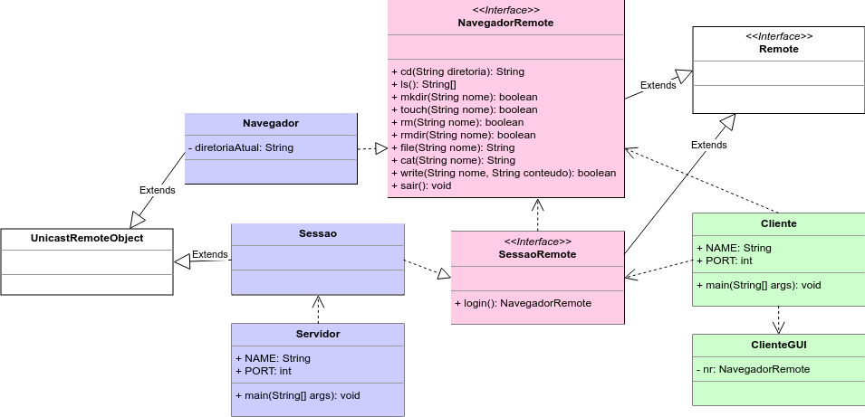
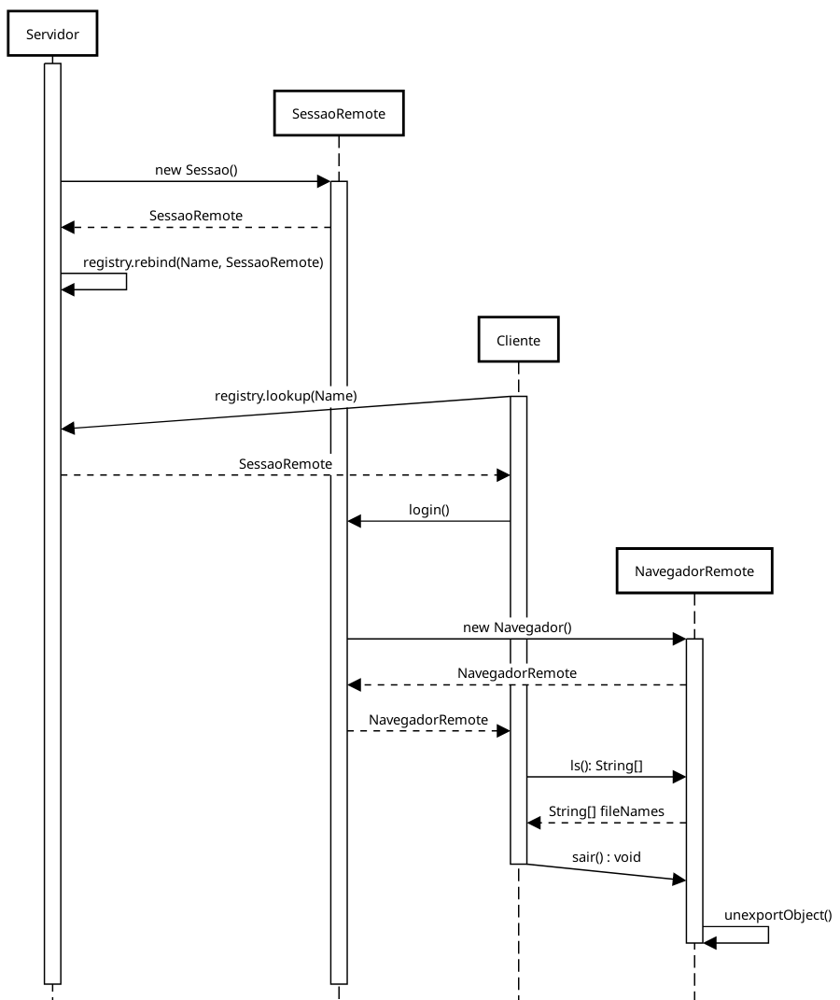
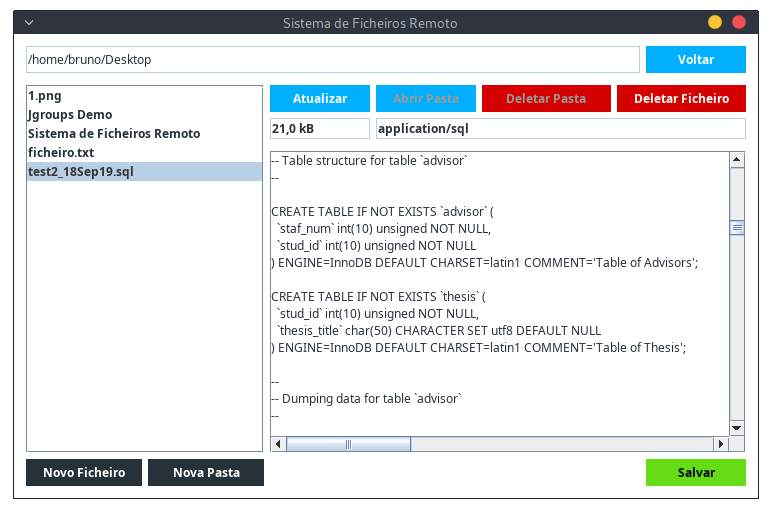
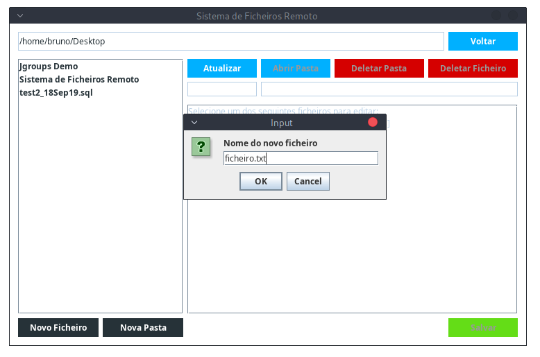

# Sistema de Ficheiros Remoto
```
Bruno Mendes de Souza
Henrique Sousa Pinheiro

Sistemas Distribuídos
Mestrado em Sistemas de Informação - Instituto Politécnico de Bragança (IPB)
```

1. [Introdução](#1-introdução)
2. [*Remote Session Pattern*](#2-remote-session-pattern)
3. [Arquitetura do *Software*](#3-arquitetura-do-software)
4. [Resultados e Conclusões](#4-resultados-e-conclusões)
5. [Referências](#5-referências)


## 1. Introdução

Um sistema distribuídos consiste em componentes de *hardware* ou
*software* localizados em uma rede de computadores que se comunicação e
coordenam sua ações somente por mensagens .

Existem diversas formas que os sistemas distribuídos podem utilizar para
a comunicação entre processos, por exemplo utilizando *sockets*. Outra
estrutura de comunicação, que será utilizada neste trabalho, é o **RMI**
– *Remote Method Invocation*.

O RMI é uma API (*Application Programming Interface*) do Java que
permite a invocação de métodos de objetos em outras instâncias da JVM –
*Java Virtual Machine*. A API fornece também, funcionalidades para
transferência de classes serializáveis e gerenciamento do *Garbage
Collector* de maneira remota.

Programas que utilizam RMI seguem a arquitetura **Cliente-Servidor**, no
qual o Servidor é responsável por instanciar o objeto e registrá-lo
através de um nome e vinculado ao um endereço de **IP** – *Internet
Protocol*, para que seja possível disponibilizá-lo como um objeto remoto
a outras instâncias da JVM. Um programa atuando como Cliente de uma
aplicação RMI é capaz de localizar uma referência para um objeto remoto
através da combinação do IP do servidor remoto, porta para conexão com o
processo e o nome registrado para o referência do objeto remoto. Com a
referência o cliente pode invocar os métodos do objeto remoto como se
fosse um objeto local.

O objetivo deste trabalho é implementar um sistema de ficheiros remoto
utilizando RMI. Este sistema distribuído deve ser constituído por dois
módulos principais, o servidor, sendo executado em uma máquina remota,
e o cliente, que irá, de forma transparente, acessar o sistema de
ficheiros remotos por intermédio de RMI. Como funcionalidade extra, foi
utilizado o conceito *Remote Session Pattern* para permitir vários
clientes em simultâneo.

Na Secção 2
será apresentado os conceitos básicos do *Remote Session Pattern*, na
Secção 3 a
arquitetura e projeto deste trabalho, e por fim, os resultados e
conclusões na
Secção 4.

## 2. *Remote Session Pattern*

Com o RMI normalmente o servidor instancia um objeto que será registrado
utilizando um nome (*string*), e no qual todo cliente ira requisitar
para a invocação remota de métodos. Quando precisa-se de um objeto
diferente para cada cliente, pode se tornar um empecilho para o sistema,
pois será necessário registrar diferentes instancias para cada cliente.

O ***Remote Session Pattern***  é uma forma simples de solucionar o
problema citado, em que o servidor registra um *singleton* que contem um
único método para retornar uma nova instancia da classe requisitada. A
seguir um exemplo básico em que a *interface* **Sessao**, contem um
método para retornar um **Objeto**.

``` java
public interface Sessao extends Remote {
    public Objeto login() throws RemoteException;
}

public class SessaoImpl extends UnicastRemoteObject implements Sessao {
    public Objeto login() RemoteException {
        // Cria uma nova instância para cada cliente
        return new ObjetoImpl();
    }
}

public interface Objeto extends Remote {
    // Métodos...
}

public class ObjetoImpl extends UnicastRemoteObject implements Objeto {
    // Overrided Métodos...
}

```

Utilizando este padrão, todo cliente requisita a classe de sessão, e
utilizando seu método requisita outro objeto remoto que não está
registrado, a seguir é apresentado um exemplo básico de utilização:

``` java
//Servidor
SessaoImpl s = new SessaoImpl();
registry.rebind("NOME", s);

//Todo Cliente
Sessao s = (Sessao) registry.lookup("NOME");
Objeto o = s.login();

```

## 3. Arquitetura do *Software*

Utilizando classes que suportam RMI, este projeto foi desenvolvido em
dois módulos principais, o servidor, sendo executado em uma máquina
remota, e o cliente, que irá, de forma transparente, acessar o sistema
de ficheiros remotos. Para o entendimento da arquitetura do projeto, foi
desenvolvido um diagrama de classes representando os principais pontos
das classes, exibido na Figura [1](#fig:diagrama-classes).



A aplicação é composta por duas *interfaces*, **SessaoRemote**, que será
registrada e fornecerá uma nova instância de **NavegadorRemote**, a
*interface* no qual são definidos o métodos que o cliente pode executar
remotamente. As duas *interfaces* são comuns para os dois módulos, o
cliente e o servidor.

No módulo do servidor, temos a classe **Servidor** contendo o método
*main*, e as classes **Navegador** e **Sessao**, que implementam as
*interfaces* **NavegadorRemote** e **SessaoRemote** respectivamente. O
módulo do cliente é constituído pela classe **Cliente**, que contem o
método *main*, e o **ClienteGUI**, classe em que é definida a interface
gráfica com o usuário.

A seguir é apresentada uma descrição básica sobre os métodos que são
oferecidos pelo objeto remoto e que são implementadas seguindo a
*interface* **NavegadorRemote**:

  - String **cd**(String **diretoria**) – este método permite a
    navegação através das directorias que se encontram no servidor do
    objeto remoto. O parâmetro *diretoria* contém o caminho para acessar
    uma outra directoria. O uso da classe **Path** do Java possibilitou
    a navegação de directorias de maneira absoluta e relativa.

  - String\[\] **ls**() – este método lista todos os ficheiros e pastas
    contidas na directoria atual.

  - boolean **mkdir**(String **nome**) este método é responsável pela
    criação de uma nova pasta. O nome da pasta que se pretende criar é
    passado através do parâmetro *nome*, e como retorno do método, o
    resultado da execução do comando no qual *true* representa que o
    comando foi executado com sucesso e *false* caso contrário. A nova
    pasta é criada sempre relativa a directoria atual.

  - boolean **touch**(String **nome**) – este método permite a criação
    de um novo ficheiro no servidor remoto. Caso a operação seja
    concluída com sucesso, um novo ficheiro, com nome dado através do
    parâmetro *nome*, é criado no servidor remoto e o método retorna o
    valor *true*. Caso algum erro ocorra na execução do comando é
    retornado um valor *false* e nenhum ficheiro é criado.

  - boolean **rm**(String **nome**) – este método é responsável pela
    remoção de um ficheiro no servidor remoto. O nome do ficheiro no
    caminho atual que se deseja remover é passado através do parâmetro
    *nome*. Caso a execução do método seja bem sucedida o valor *true* é
    retornado, e *false* caso contrário.

  - boolean **rmdir**(String **nome**) – este método segue o mesmo
    comportamento do método *rm* porém, nesse caso, somente directorias
    são removidas.

  - String **file**(String **nome**) – este método retorna informações
    de tamanho, tipo de conteúdo sobre o ficheiro com o nome passado por
    parâmetro. As informações são compostas numa única *String* com cada
    tipo de informação separada por um *pipe*(|), por exemplo:
    12B|text/file. Caso seja uma directoria apenas a informação
    *Dir* é retornada.

  - String **cat**(String **nome**) – este método recebe o nome de um
    ficheiro de texto através do parâmetro *nome*, fazendo a leitura do
    conteúdo e retornando-o em uma única *String*.

  - boolean **write**(String **nome**, String **conteudo**) – este
    método permite que uma aplicação cliente crie um novo ficheiro com
    formato texto no servidor remoto. O nome do ficheiro é passado
    através do parâmetro *nome* e o conteúdo através do parâmetro
    *conteudo*. Caso a execução do comando seja bem sucedida o valor
    *true* é retornado, e *false* caso contrário.

  - void **sair**() – este método é responsável por sinalizar ao
    servidor remoto que o objeto não será mais utilizado por meio do
    método *unexpertObject(this, true)* presente na API do RMI. Dessa
    maneira o objeto pode ser coletado pelo *Garbage Colletor* e o
    recurso de memória liberado.

Quando a aplicação **Servidor** é iniciada ocorre a instanciação e o
registro, para o acesso remoto, de um objeto da classe **Sessao**, que é
a classe responsável por fornecer novas instâncias da classe
**NavegadorRemote** para qualquer novo cliente.

Quando uma aplicação cliente inicia sua execução, é necessário que seja
feito uma busca (*lookup*) da referência do objeto remoto que é exposto
pelo Servidor, nesse caso um objeto da classe **Sessao**. Com a
referência o cliente é capaz de executar o método *login()* e obter um
novo objeto remoto da classe **NavegadorRemote** permitindo a navegação
pelo sistema de ficheiros do servidor remoto. A
Figura [2](#fig:diagrama-sequencia-sessao) mostra, em um diagrama de
sequência, como ocorre o fluxo de inicialização do Servidor e a conexão
de novos clientes com o controle feito pela classe **Sessao**.



## 4. Resultados e Conclusões

Para o gerenciamento das configurações de execução foi utilizada a
ferramenta **Gradle**. Com o Gradle é possível automatizar o processo de
compilação e, através da sua *DSL – Domain Specific Language*, podemos
definir tarefas para serem executadas por comandos especificados.

Para esse projeto, com o uso do Gradle, foi definido duas tarefas de
execução. A tarefa *client* é responsável por iniciar o cliente e
conectá-lo a um *host* servidor no endereço especificado através do
argumento *registryAddress*. Na tarefa *server* o servidor é iniciado e
os registros são criados e vinculados ao endereço de IP especificado
pelo argumento *registryAddress*. A seguir são apresentados os comandos
para execução do programa nos modos Servidor e Cliente:

``` bash
# Servidor
./gradlew server -PregistryAddress=<IP_PARA_BIND>

# Todo Cliente
./gradlew client -PregistryAddress=<IP_DO_SERVIDOR>

```

Após a execução do servidor e a execução de um cliente, podemos observar
o resultado do desenvolvimento deste trabalho, por exemplo na
Figura [3](#fig:cliente-sistemas-ficheiros-remoto), em que temos a
interface gráfica disponível para o usuário realizar operações no
sistema de ficheiros remoto.



Na interface gráfica é exibido o caminho da directoria atual e uma lista
com o seu conteúdo. Nesta directoria podemos selecionar pastas e
ficheiros para serem deletados, e no caso de ficheiros que terminem com
.txt, .json, .sql e etc, ao serem selecionados é exibido o seu conteúdo
em uma caixa de texto para a edição, e habilitado um botão para salvar
as modificações no ficheiro.

Selecionando qualquer ficheiro são exibidos duas informações, o tamanho
e o *MIME type*. Na interface ainda é possível utilizar um botão para
voltar na directoria anterior, e selecionando uma pasta, outro botão
para entrar nesta pasta. Em casos que deseja-se verificar se houve
modificações na directoria atual, há um botão atualizar, que requisita
novamente o conteúdo da pasta atual.

As outras duas funcionalidades disponíveis na interface gráfica são
criar uma nova pasta e um novo ficheiro, exibido na
Figura [4](#fig:cliente-sistemas-ficheiros-remoto-2). Ao selecionar
estas opções será exibido uma caixa requisitando o nome, e em seguida
teremos a pasta ou ficheiro criados na directoria atual.



Testes foram realizados utilizando uma rede local e vários clientes em
simultâneo, obtendo o resultado esperado. Logo concluímos que o objetivo
inicial do trabalho foi alcançado, e após o projeto da arquitetura do
*software* e o desenvolvimento do mesmo, tivemos como resultado um
sistema de ficheiros remoto utilizando RMI, e permitindo vários clientes
em simultâneo.

## 5. Referências

> Coulouris, G., Dollimore, J., and Tim Kindberg, G. B. (2013). Sistemas Distribuídos - 5ed: Conceitos e Projeto. Bookman Editora.

> Pitt, E. and McNiff, K. (2001).java.rmi: The Remote Method Invocation Guide. Addison-Wesley
